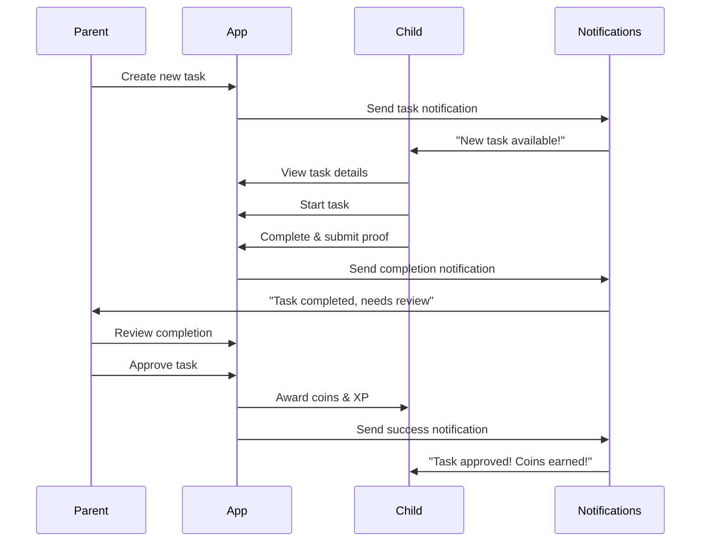
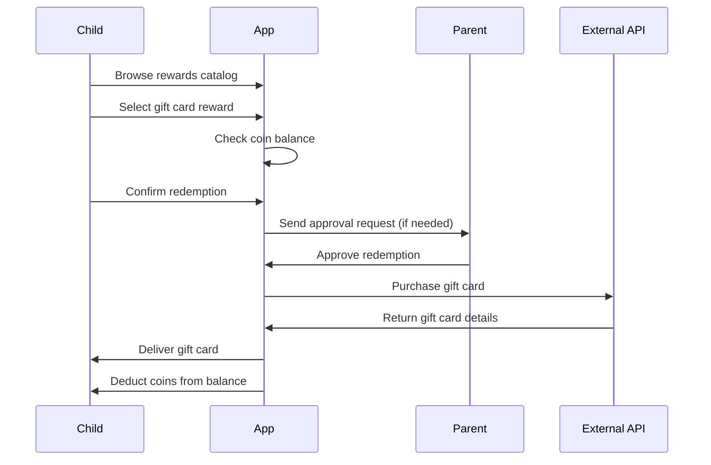
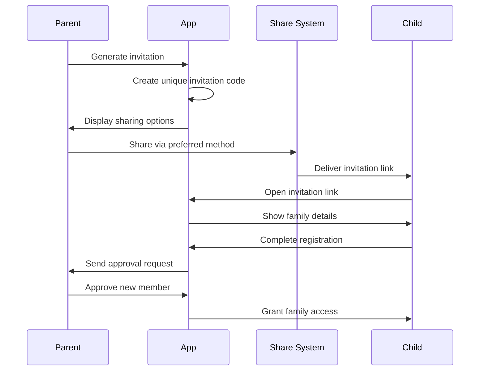

# User Flows & Navigation Structure

## Overview

This document outlines the complete user journey flows for both parents and children in the LevelUp Family app, from onboarding through daily usage patterns.

## Core User Flows

### 1. Parent Onboarding Flow

```
Start → Email/Password Registration → Email Verification → 
Family Setup (Create/Join) → Child Invitation → Dashboard
```

**Detailed Steps:**

1. **Welcome Screen**
   - App introduction and value proposition
   - "Get Started" or "I'm a Parent" button
   - Option to sign in if returning user

2. **Parent Registration**
   - Email address input
   - Password creation (with strength requirements)
   - Terms of service acceptance
   - Privacy policy acknowledgment

3. **Email Verification**
   - Verification code sent to email
   - Code input screen with resend option
   - Auto-redirect on successful verification

4. **Family Setup Choice**
   - **Create New Family**:
     - Family name input
     - Family description (optional)
     - Initial settings (timezone, currency)
   - **Join Existing Family**:
     - Family code input
     - Wait for approval from existing parent

5. **Profile Completion**
   - Display name
   - Avatar selection/upload
   - Timezone confirmation

6. **Child Invitation**
   - Generate invitation link/code
   - Share via phone's native sharing
   - SMS, email, messaging apps integration
   - QR code option for local sharing

7. **Dashboard Introduction**
   - Feature tour overlay
   - First task creation prompt
   - Setup completion celebration

### 2. Child Onboarding Flow

```
Invitation Link → Age Verification → Registration/Profile → 
Parent Approval → Welcome Tour → Child Dashboard
```

**Detailed Steps:**

1. **Invitation Reception**
   - Open invitation link (deep link)
   - Family information display
   - "Join Family" button

2. **Age Verification**
   - Date of birth input
   - COPPA compliance check
   - Parent consent flow if under 13

3. **Child Registration**
   - Username creation (unique within family)
   - Display name
   - Avatar selection from kid-friendly options
   - Simple password or PIN setup

4. **Parent Approval**
   - Notification sent to parent
   - Child sees "waiting for approval" screen
   - Push notification when approved

5. **Welcome & Tutorial**
   - Family welcome message
   - Basic app tutorial (interactive)
   - First available tasks display
   - Coin system explanation

6. **Child Dashboard**
   - Available tasks list
   - Current coin balance
   - Progress indicators

### 3. Daily Parent Workflow

#### Task Management Flow
```
Dashboard → Task List → Create/Edit Task → Assign to Child → 
Monitor Progress → Review Completion → Approve/Reject
```

**Detailed Steps:**

1. **Dashboard Overview**
   - Family activity summary
   - Pending approvals count
   - Recent completions
   - Quick action buttons

2. **Task Creation**
   - Task title and description
   - Category selection (chores, homework, exercise, etc.)
   - Difficulty level (affects rewards)
   - Coin and XP reward amounts
   - Due date selection
   - Photo requirement toggle
   - Recurrence settings

3. **Task Assignment**
   - Child selection (multi-select for multiple children)
   - Individual customization per child
   - Notification sending

4. **Progress Monitoring**
   - Real-time task status updates
   - Child progress notifications
   - Completion photo review

5. **Approval Process**
   - Completion details review
   - Photo verification
   - Feedback to child
   - Coin/XP award confirmation

#### Reward Management Flow
```
Rewards Catalog → Create Custom Reward → Set Availability → 
Monitor Redemption Requests → Approve/Fulfill
```

### 4. Daily Child Workflow

#### Task Completion Flow
```
Task List → Select Task → Complete Task → Submit Proof → 
Wait for Approval → Earn Rewards
```

**Detailed Steps:**

1. **Task Discovery**
   - Browse available tasks
   - Filter by category, reward, difficulty
   - Task details view with requirements

2. **Task Execution**
   - "Start Task" button
   - Timer starts (if applicable)
   - Progress tracking
   - Photo capture requirement

3. **Completion Submission**
   - Photo upload (if required)
   - Completion notes
   - Quality self-assessment
   - Submit for parent review

4. **Reward Collection**
   - Approval notification
   - Coin balance update animation
   - XP gain and level progress
   - Achievement unlocks

#### Reward Redemption Flow
```
Reward Catalog → Select Reward → Confirm Purchase → 
Parent Approval (if needed) → Reward Fulfillment
```

## Navigation Structure

### Parent Navigation Hierarchy

```
Parent App Root
├── Dashboard (Home Tab)
│   ├── Family Overview
│   ├── Recent Activity
│   ├── Quick Actions
│   └── Pending Reviews
│
├── Tasks Tab
│   ├── All Tasks List
│   ├── Create Task
│   ├── Task Categories
│   ├── Recurring Tasks
│   └── Task Analytics
│
├── Family Tab
│   ├── Family Members
│   ├── Member Profiles
│   ├── Invite New Members
│   ├── Family Settings
│   └── Achievements
│
├── Rewards Tab
│   ├── Reward Catalog
│   ├── Create Custom Reward
│   ├── Redemption Requests
│   ├── Redemption History
│   └── Gift Card Management
│
└── Profile Tab
    ├── Parent Profile
    ├── App Settings
    ├── Notifications
    ├── Privacy Settings
    └── Help & Support
```

### Child Navigation Hierarchy

```
Child App Root
├── Home Tab (Dashboard)
│   ├── Available Tasks
│   ├── Active Tasks
│   ├── Recent Achievements
│   └── Daily Progress
│
├── Tasks Tab
│   ├── All Available Tasks
│   ├── My Active Tasks
│   ├── Completed Tasks
│   ├── Task History
│   └── Favorites
│
├── Rewards Tab
│   ├── Reward Catalog
│   ├── My Wishlist
│   ├── Redemption Cart
│   ├── Redemption History
│   └── Available Coins
│
├── Profile Tab
│   ├── My Progress
│   ├── Achievements & Badges
│   ├── Statistics
│   ├── Level Progress
│   └── Settings
│
└── Wallet Tab
    ├── Coin Balance
    ├── Transaction History
    ├── Earning Opportunities
    └── Spending Analysis
```

## Critical User Journeys

### Journey 1: First Task Creation to Completion



### Journey 2: Child Reward Redemption



### Journey 3: Family Invitation Process



## Error Flows and Edge Cases

### Connection Issues
- **Offline Task Completion**: Tasks can be completed offline, synced when connection restored
- **Partial Sync**: Handle partial data synchronization gracefully
- **Conflict Resolution**: Parent and child modify same data simultaneously

### Payment/Reward Issues
- **Insufficient Coins**: Clear messaging and earning suggestions
- **Gift Card API Failure**: Retry mechanism and customer support contact
- **Delayed Fulfillment**: Status tracking and communication

### Family Management Issues
- **Child Leaves Family**: Data retention and re-invitation process
- **Parent Account Deletion**: Family ownership transfer or dissolution
- **Inappropriate Content**: Reporting and moderation workflows

## Accessibility Considerations

### Navigation Accessibility
- **Screen Reader Support**: All navigation elements properly labeled
- **Voice Control**: Support for voice navigation commands
- **High Contrast Mode**: Enhanced visibility for navigation elements
- **Large Text Support**: Scalable navigation text and buttons

### Workflow Accessibility
- **Alternative Input Methods**: Support for switch controls and external keyboards
- **Reduced Motion**: Respect system preference for reduced animations
- **Color Independence**: Don't rely solely on color for navigation cues
- **Focus Management**: Logical focus order and clear focus indicators

## Performance Considerations

### Navigation Performance
- **Lazy Loading**: Load screens on demand to reduce initial bundle size
- **Route Preloading**: Preload likely next screens based on user patterns
- **Transition Optimization**: Use native transitions for smooth navigation

### Data Loading Patterns
- **Progressive Loading**: Show basic UI immediately, load data progressively
- **Background Sync**: Update data in background while user navigates
- **Optimistic Updates**: Show expected results immediately, reconcile later

This user flow documentation provides a comprehensive guide for implementing intuitive navigation and user experiences across all family member roles in the LevelUp Family app.